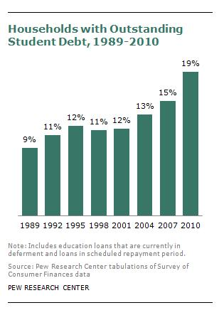
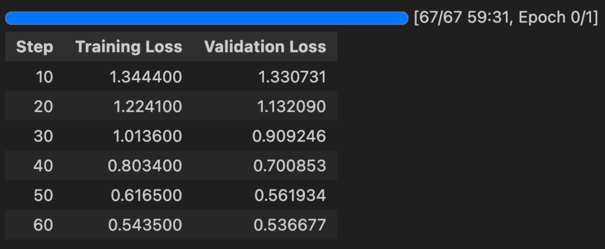

# Abstract
This essay details an experiment investigating the feasibility of knowledge distillation from a large language model (LLM) to a smaller vision-language model (VLM) for the specific task of generating high-quality IELTS Task 1 essays describing visual charts and trends. Faced with the lack of suitable public datasets pairing charts with Band 9 level essays, a synthetic dataset was generated using the MiniMax LLM (456B parameters) via carefully engineered prompts. A smaller, open-source VLM, SmolVLM (7B parameters), was then fine-tuned on this dataset. Two fine-tuning approaches were compared: one using structured essay formats and another using unstructured formats. Evaluation using the LLM-as-a-Judge method demonstrated that fine-tuning significantly improved SmolVLM's essay generation capabilities compared to its baseline performance. What is more, fine-tuning on the unstructured dataset yielded superior results (79% win rate against baseline) compared to the structured dataset (66% win rate), suggesting that rigid output structures may be less beneficial for fine-tuning smaller models in this context. The experiment confirms the viability of knowledge distillation for creating specialized, smaller models for complex multimodal tasks, offering a cost-effective alternative to relying solely on large-scale LLMs that need specialized hosting.

# Introduction and Motivation
Large Language Models (LLMs) have demonstrated remarkable capabilities across various domains, including education and evaluation. During my preparations for the IELTS examination, the potential of LLMs like GPT and Claude for providing feedback on writing tasks became apparent. This sparked my interest in exploring whether smaller, more accessible models could be trained to perform specific, complex tasks traditionally handled by these large models, thereby reducing reliance on costly API calls.

A particularly relevant task within the IELTS Writing section is Task 1, which requires describing and summarizing information presented in visual formats like bar charts, line graphs, pie charts, and tables. This task demands both visual understanding and good quality language expression. The core question motivating this project was: **Is it possible to transfer the sophisticated essay-writing capabilities of a very large LLM to a much smaller model, specifically for the IELTS Task 1 chart description task?** This involves overcoming the challenge of data scarcity, as high-quality datasets mapping charts to corresponding Band 9 IELTS essays are not readily available.

This work focuses on using [knowledge distillation](https://arxiv.org/abs/2402.13116)—transferring knowledge from a large "teacher" model to a smaller "student" model—to address this challenge. Specifically, I aimed to distill the ability to generate high-scoring IELTS Task 1 essays from the MiniMax LLM (456B parameters) into the SmolVLM (7B parameters), a vision-language model chosen for its image understanding capabilities.

# Methodology
The project followed a structured pipeline consisting of data generation, model fine-tuning, and evaluation.

##  Model Selection

- Teacher Model: MiniMax, a 456 billion parameter LLM, was selected as the teacher model due to its advanced generative capabilities and, at the time of the experiment, its cost-effective API access.

- Student Model: SmolVLM, a 7 billion parameter Vision-Language Model, was chosen as the student. Its strengths lie in interpreting visual information, a crucial requirement for the task. While capable of image understanding, its baseline text generation for complex tasks like essay writing was found to be rudimentary.

### Example of SmolVLM essay writing
```text
The U.S. working-age population is projected to grow by 18 million between 2015 and 2035, according to a Pew Research Center analysis of Census Bureau data. But without future immigration, the working-age population would shrink by 166 million, or 86 percent, by 2035.
```

## Dataset Creation via Knowledge Distillation
Given the absence of a suitable dataset pairing charts with high-quality IELTS Task 1 essays, a synthetic dataset was generated using the teacher model.

- Chart Data Source: Images and plot titles were sourced from the Chart-to-text dataset repository [https://github.com/vis-nlp/Chart-to-text/tree/main], previously used in [chart summarization research](https://aclanthology.org/2022.acl-long.277/).

- Prompt Engineering: To create high-quality, IELTS-specific essays from MiniMax, I creafted prompts for each chart type (bar, line, pie, table). These prompts incorporated several techniques:

    - [Few-Shot Learning](https://arxiv.org/abs/2005.14165): Included 2-3 examples of high-scoring essays relevant to the chart type.

    - [Chain-of-Thought (CoT)](https://arxiv.org/abs/2201.11903): Guided the model to break down the task (e.g., describe graph, find key points/trends, write summary).

    - Structured Input/Output: Defined a clear structure for the output essay to ensure consistency and format to IELTS Task 1 requirements (e.g., introduction, body paragraphs detailing trends and comparisons, conclusion). This structure helped mitigate MiniMax's tendency to generate overly long or short responses.

- Data Generation: MiniMax was prompted with chart images and the engineered prompts to generate corresponding essays. The total cost for generating the dataset (3.5k essays) was approximately $12.

### Example prompt for pie chart:

```py
"""Summarise the information by selecting and reporting the main features, make comparisons where relevant.
The essay part should consist of MAXIMALLY 190 words!!! 
Use IELTS Academic Band 9 vocabulary.
Avoid repetition.
Don't replicate provided Examples!
Use given structured output:
    1. Graph description
    2. Body paragraphs (2-3 separate paragraps)
    3. Overview of the data

Example 1.
    
<TITLE_1>: "Comparison of Energy Production in France in two years"
[IMAGE_1]

Follow given structured input:
1. <Describe a graph:>
"The two pie charts illustrate the proportion of five sources of energy production (coal, gas, nuclear, petrol and other sources) in France in two years (1995 and 2005)."

2. <Find the key points and trends:>

Paragraph 1:
"Energy produced by coal comprised of 29.80% in 1995 and by 2005, it increased by about 1% to 30.9%. Likewise, the amount of energy generated by gas went up by approximately 1% from 29.63% in the first year to 30.1% by the final year. The use of nuclear power rose significantly from 6.40% in 1995 to 10.10% in 2005. Other sources of energy production accounted for 4.90% but then climbed to 9.10%."

Paragraph 2: 
"Petrol, on the other hand, produced 29.27% of all energy in 1995 but 10 years later only 19.55% of energy came from this source."

3. <Write a summary of presented data:>
"Overall, in both years coal and gas accounted for over half of all energy production, while the least was other energy sources. There was only a very minimal increase in production from gas and coal, whereas nuclear and other sources almost doubled. Petrol was the only energy source to decrease over the period."

Example 2.

<TITLE_2>: "Employment sectors of graduates from Brighton University in 2019."
[IMAGE_2]

Follow given structured input:
1. <Describe a graph:>
"The pie chart illustrates the career choices of Brighton University's 2019 graduates, giving the percentages who worked in each of various sectors after finishing university."

2. <Find the key points and trends:>

Paragraph 1: 
"Just under half the students went into industry, with service industries attracting more Brighton graduates than any other sector by far — almost a third (33.0%). About half that number (16.3%) took jobs in manufacturing."

Paragraph 2: 
"Politics and public service were the next most popular choice, accounting for nearly a fifth of graduates. Just over 12% went into politics and a further 5.6% chose the civil service. The other significant career choices were education (about 15%) and two others: transportation and warehousing, with 7.8%; and science and technology with 7.3%."

Paragraph 3:
"The least popular choices included work in the charitable sector and careers in sport, both of which were chosen by well under 1% of graduates. Finally, 2.8% entered work in other, unspecified, sectors."

3. <Write a summary of presented data:>
"Overwhelmingly, industry and government were the most popular employment sectors, far surpassing all other types of employment."


Example 3.
<TITLE_3>: "Percentage of Brtitish Students able to speak languages other than English in two given years."
[IMAGE_3]

Follow given structured input:
1. <Describe a graph:>
"The pie charts display the percentages of British students from one English university who were able to speak languages other than English in 2000 and 2010."

2. <Find the key points and trends:>

Paragraph 1: 
"Those who spoke only Spanish accounted for the greatest proportions of students in both 2000 and 2010, at 30 and 35 percent respectively. With an increase to 20 and 15 percent, those who spoke another language and those who spoke two other languages became the second and third largest groups in 2010. The proportion of those who spoke no additional languages, in comparison, dropped by half to only 10 percent."

Paragraph 2: 
"Of those who were able to speak other languages, French-only speakers were the only group whose proportion experienced a decline from 15 to 10 percent, while the proportion of German-only speakers stayed at 10 percent."


3. <Write a summary of presented data:>
"Overall, the proportion of students who were able to speak additional languages went up in 2010, with Spanish being the most commonly spoken one in both years."

Answer.

<TITLE_LAST>: "{title}"
[{image_name}].
Follow given structured input:
"""
```

### Dataset Variants
Two versions of the dataset were created from the MiniMax outputs to investigate the impact of output structure on fine-tuning:

### Structured Dataset:
Contained chart images, titles, and the generated essays preserving the explicit structure (e.g. numbered steps, paragraph labels) used in the CoT prompting. (Dataset available at: [https://huggingface.co/datasets/szymmon/SmolVLM_Essay_Structured])
    
#### Example record from the dataset:



```text
1. <Describe a graph>:
"The bar chart illustrates the percentage of households with outstanding student debt in the United States from 1989 to 2010."

2. <Find the key points, trends and compare data>:

Paragraph 1:
"The data reveals a clear upward trend in the percentage of households with outstanding student debt over the given period. In 1989, only 9% of households had such debt, but this figure rose steadily over the years, reaching 19% by 2010."

Paragraph 2:
"The most significant increases occurred between 2004 and 2010. In 2004, 12% of households had outstanding student debt, which increased to 13% by 2007 and then jumped to 15% by 2010. This suggests a growing reliance on student loans over the years."

Paragraph 3:
"Interestingly, the period between 1989 and 2001 saw relatively modest increases, with the percentage rising from 9% to 11%. However, the subsequent years marked a sharper rise, indicating a possible shift in the economic or educational landscape."

3. <Write a summary of presented data>:
"Overall, the chart demonstrates a significant increase in the percentage of households with outstanding student debt from 1989 to 2010. The most notable growth occurred in the latter part of the period, highlighting a growing trend of borrowing for education."
```

### Unstructured Dataset:
Contained the same chart images and titles, but the essays were processed to remove the explicit structural markers, resulting in standard paragraph-based text. (Dataset available at: [https://huggingface.co/datasets/szymmon/SmolVLM_Essay_Database])

Example of Unstructured Output:

```text
The bar chart illustrates the percentage of households with outstanding student debt in the United States from 1989 to 2010.

The data reveals a clear upward trend in the percentage of households with outstanding student debt over the given period. In 1989, only 9% of households had such debt, but this figure rose steadily over the years, reaching 19% by 2010.

The most significant increases occurred between 2004 and 2010. In 2004, 12% of households had outstanding student debt, which increased to 13% by 2007 and then jumped to 15% by 2010. This suggests a growing reliance on student loans over the years.

Interestingly, the period between 1989 and 2001 saw relatively modest increases, with the percentage rising from 9% to 11%. However, the subsequent years marked a sharper rise, indicating a possible shift in the economic or educational landscape.

Overall, the chart demonstrates a significant increase in the percentage of households with outstanding student debt from 1989 to 2010. The most notable growth occurred in the latter part of the period, highlighting a growing trend of borrowing for education.
```

### Dataset split
The dataset (3,475 examples) was divided into:

- Train: 2,432 samples (used in fine-tuning)
- Test: 521 samples (used in evaluation)
- Validation: 522 samples (used in fine-tuning)


## SmolVLM Fine-tuning
The SmolVLM model was fine-tuned separately on both the structured and unstructured datasets. The primary objective was to teach the model to generate well-structured, linguistically appropriate essays based on the input chart image.

- **Hardware**: Training was performed on an Nvidia H100 80GB GPU, accessed via PrimeIntellect ([https://www.primeintellect.ai/]).

- **Training Parameters**: A batch size of 6 was used to maximize GPU memory utilization. Training loss curves were monitored for both fine-tuning runs.

### Structured Dataset Training Loss


### Unstructured Dataset Training Loss


# Evaluation
Evaluating the quality of generated essays presents challenges due to the subjective nature of writing assessment and the potential for varied, yet valid interpretations of chart data. To address this, the [LLM-as-a-Judge](https://arxiv.org/abs/2411.15594) approach was employed.

- **Method**: The MiniMax model, which served as the teacher for data generation, was used as the evaluator. It was presented with pairs of essays for the same chart: one generated by the baseline (non-fine-tuned) SmolVLM and one generated by the fine-tuned SmolVLM (either from the structured or unstructured training).

- **Task**: MiniMax was instructed to determine which of the two essays was better in terms of quality, structure, accuracy, and relevance to the IELTS Task 1 criteria.

- **Evaluation Sets**: The evaluation was performed on samples drawn from the test set (272 for structured, 295 for unstructured datasets).

### Evaluation prompt:
```py
"""Decide which plot description resembles the one below more and is more accurate to the plot image provided. In order to choose essay you need
    to answer with word: <FIRST> (indicating the first one is better) or <SECOND> (indicating the second is better).

    Here is the golden standard essay you ought to compare to:
    {golden_title}
    {golden_essay}

    <FIRST>
    {first_essay}

    <SECOND>
    {second_essay}
"""
```

# Results and Discussion
The evaluation based on LLM-as-Judge approach yielded the following results:
    
- **Structured Dataset Fine-tuning**:

    - Fine-tuned model preferred over baseline: 180 out of 272 cases.
    - Baseline model preferred over fine-tuned: 92 out of 272 cases.
    - Success Rate (Win Rate vs. Baseline): 66% (baseline represents a 50% random chance).

- **Unstructured Dataset Fine-tuning**:

    - **Fine-tuned model** preferred over baseline: 235 out of 295 cases.
    - **Baseline model** preferred over fine-tuned: 60 out of 295 cases.
    - **Success Rate** (Win Rate vs. Baseline): 79%

These results clearly indicate that fine-tuning SmolVLM on the synthetically generated data significantly improved its ability to produce relevant and higher-quality IELTS Task 1 essays compared to its baseline performance. Furthermore, fine-tuning on the unstructured dataset led to a notably higher success rate than fine-tuning on the structured dataset.

### Further Observations

While both fine-tuning methods showed improvement, qualitative analysis revealed distinct behaviors and failure modes:

- **Structured Fine-tuning**:

    - **Successes**: Capable of producing well-structured and accurate descriptions to provided chart image.
    - **Failures**: Prone to generating outputs that were not essays, such as lists of questions about the data, or adopting alternative, unexpected formatting structures not present in the training examples. This suggests the model may have struggled to consistently interpret and replicate the rigid structure imposed during fine-tuning.

### Example of success:
```text
 1. <Describe a graph>:
"The bar chart illustrates the volume of container-handling ports in Japan in 2012, measured in TEUs (Twenty-foot Equivalent Units). The data is presented for five different ports: Tokyo, Yokohama, Nagoya, Kobe, and Osaka."

2. <Find the key points, trends and compare data>:

Paragraph 1:
"Tokyo is the largest container-handling port in Japan, with a volume of 4,751,653 TEUs in 2012. This figure is significantly higher than the other ports, indicating a substantial volume of container traffic through Tokyo. Yokohama follows closely, with a volume of 3,052,775 TEUs, highlighting its importance as a major port for container shipping."

Paragraph 2:
"Nagoya and Kobe also have substantial volumes, with Nagoya's volume at 2,655,225 TEUs and Kobe's at 2,567,540 TEUs. These figures suggest that Nagoya and Kobe are important ports for container shipping, although they are less significant compared to Tokyo and Yokohama. Osaka, on the other hand, has a volume of 2,409,754 TEUs, indicating a moderate volume of container traffic."

3. <Write a summary of presented data>:
"Overall, Tokyo, Yokohama, Nagoya, Kobe, and Osaka are the major container-handling ports in Japan in 2012, with Tokyo being the largest by volume. The volume of container traffic varies, with Tokyo being the largest and Osaka the smallest. Nagoya and Kobe also have substantial volumes, indicating their importance in the container shipping industry."
```

### Examples of failures:

Random Questions

```text
1. What is the percentage of foreign-born population in the U.S. in 1840?
2. What is the percentage of foreign-born population in the U.S. in 1920?
3. What is the percentage of foreign-born population in the U.S. in 2000?
4. What is the percentage of foreign-born population in the U.S. in 2060?
```

Model created alternative formatting

```text
The line chart illustrates the trend of removals of unauthorized immigrants in the United States from fiscal year 2000 to 2018. The data is presented in two formats: removals of unauthorized immigrants and removals of unauthorized immigrants by fiscal year.

**Removals of unauthorized immigrants:**

- **Total:** The total number of removals of unauthorized immigrants has increased from 188,467 in fiscal year 2000 to 337,287 in fiscal year 2018.
- **Increase:** The number of removals has risen steadily from 2000 to 2018, with the most significant increase between fiscal years 2008 and 2010.
- **Decrease:** There was a slight decrease in removals between fiscal years 2010 and 2012, followed by a gradual increase from 2012 to 2018.

**Removals of unauthorized immigrants by fiscal year:**

- **Fiscal Year 2000:** The number of removals in fiscal year 2000 was 188,467.
- **Fiscal Year 2018:** The number of removals in fiscal year 2018 was 337,287.

**Key Aspects and Trends:**

- **Increase in Removal Rate:** The removal rate of unauthorized immigrants has increased significantly over the years. From fiscal year 2000 to 2018, the removal rate has risen from 188,467 to 337,287, which is a 77% increase.
- **Fiscal Year 2018:** The highest number of removals was recorded in fiscal year 2018, with 337,287 removals. This is a significant increase from the previous year, indicating a continued rise in the removal rate.
- **Decrease in Removal Rate:** There was a slight decrease in the removal rate between fiscal years 2010 and 2012, followed by a gradual increase from 2012 to 2018.

**Conclusion:**

Overall, the data shows a consistent upward trend in the removal of unauthorized immigrants in the United States from fiscal year 2000 to 2018. The most significant increase occurred between fiscal years 2008 and 2010, followed by a gradual increase from 2012 to 2018. The removal rate has risen significantly, with the highest number of removals recorded in fiscal year 2018. This indicates a continued effort by the U.S. government to enforce immigration laws and remove unauthorized immigrants from the country.
```


- **Unstructured Fine-tuning**:

    - **Successes**: Generally produced coherent and relevant essays that captured key trends and comparisons.
    - **Failures**: Occasionally produced outputs that were too brief or lacked clear paragraph separation, indicating potential issues with learning appropriate length and discourse structure, though these failures were less severe than the structural deviations observed with the structured fine-tuning.

### Example of success:
```text
The bar chart illustrates the volume of container-handling ports in Japan in 2012, measured in TEUs (Twenty-foot Equivalent Units).

The data reveals that Tokyo was the largest container-handling port in Japan in 2012, with a volume of 4,751,653 TEUs. This was significantly higher than the volume of Yokohama, which was 3,052,775 TEUs. Nagoya and Kobe followed, with volumes of 2,655,225 and 2,567,540 TEUs respectively.

Osaka ranked fourth with a volume of 2,409,754 TEUs, while Nagoya and Kobe were tied for fifth with 2,655,225 and 2,567,540 TEUs, respectively.

Overall, Tokyo was the dominant container-handling port in Japan in 2012, with a volume significantly higher than other ports. Yokohama, Nagoya, Kobe, and Osaka followed, with varying but notable volumes.

This data highlights the importance of Tokyo as a major container-handling port in Japan, with a substantial volume compared to other ports. The data also indicates the relative importance of Nagoya and Kobe, while Osaka and Nagoya were tied for fifth place.
```

### Examples of failure

Sometimes too short
```text
Percentage of state legislators who are women
```

Structure not properly maintaned
```text
The chart illustrates the number of unauthorized immigrants removed from the United States from fiscal year 2000 to 2018. The data reveals a significant increase in removals from fiscal year 2000 to 2008, peaking at 432,281 in 2008. Following this peak, removals declined, reaching a low of 337,287 in fiscal year 2016. However, removals have rebounded since then, with a notable rise in 2018, reaching 337,287.

Overall, the data indicates a trend of increasing removals of unauthorized immigrants from fiscal year 2000 to 2008, followed by a decline and subsequent recovery. The most significant increase occurred between fiscal years 2000 and 2008, with removals peaking at 432,281 in 2008. Following this peak, removals declined, but have since rebounded, reaching 337,287 in fiscal year 2018.

The data also highlights the impact of the Trump administration's immigration policies, which included increased enforcement efforts and the implementation of the "Remain in Mexico" policy. These policies are likely to have contributed to the decline in removals in fiscal years 2016 and 2017. However, the recent increase in removals suggests that these policies may have had a less significant impact on the overall trend.

In conclusion, the data shows a fluctuating trend in removals of unauthorized immigrants from fiscal year 2000 to 2018. The most significant increases occurred between fiscal years 2000 and 2008, followed by a decline and subsequent recovery. The recent increase in removals suggests that the Trump administration's immigration policies may have had a less significant impact on the overall trend.
```

The superior performance of the unstructured dataset fine-tuning is an interesting finding. While providing explicit structure during the prompting of the large MiniMax model was beneficial for controlling its output during data generation, imposing this same rigid structure during the fine-tuning of the smaller SmolVLM seemed less effective, potentially confusing the model. The unstructured format, allowing for more natural language flow, appeared to facilitate better learning for the smaller model in this specific task.


# Conclusion

This experiment successfully demonstrated the feasibility of using knowledge distillation to train a smaller Vision-Language Model (SmolVLM) for the specialized task of generating IELTS Task 1 essays from charts. By leveraging a large language model (MiniMax) and careful prompt engineering, a synthetic dataset was created, enabling effective fine-tuning.

The key findings are:

- **Knowledge distillation** is a viable technique for transferring complex, multimodal generative capabilities from large models to smaller, more resource-efficient models.

- **Fine-tuning** a smaller, specialized model like SmolVLM can yield significant improvements for domain-specific tasks, offering a practical alternative to deploying massive LLMs.

- For fine-tuning the smaller SmolVLM in this context, using training data with a natural, unstructured essay format resulted in better performance and fewer structural errors compared to using data with an explicitly enforced structure. This contrasts with the utility of structured prompts for guiding the larger teacher model during data generation.

My work highlights the potential of targeted fine-tuning and knowledge distillation for creating capable, smaller models for niche applications, particularly those involving multimodal understanding and generation. The insights regarding the impact of data structure on fine-tuning smaller models might help in future tasks involving fine-tuning smaller models.