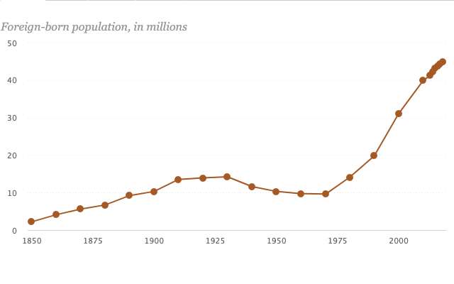
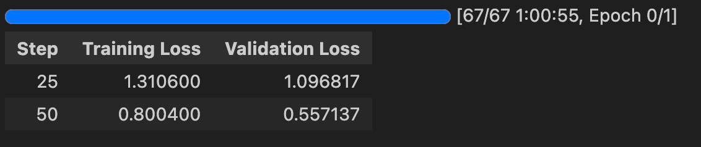
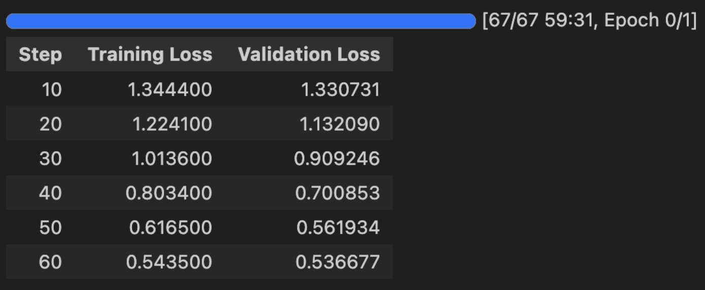

# Knowledge extraction from MiniMax model
The aim of this project was to determine whether it is possible to extract knowledge for writing IELTS Task 1 Band 9 essays from a large language model (LLM) with 456B parameters (MiniMax). The goal was to transfer this knowledge to a smaller language model (7B SmolVLM), which is open-source, easy to train, and specialized in chart analysis.

# General idea of extraction
The project follows a pipeline approach:
1. Use prompt engineering to "convince" MiniMax to generate Band 9 IELTS Task 1 essays.
2. Collect the generated essays to create a structured database.
3. Train the SmolVLM model on this artificial dataset.
4. Evaluate the training using the LLM-as-a-Judge approach.

# Data generation
To generate the essays, I used a Chain-of-Thought style prompt. For each category of data representation (bar, line, pie, table), I created separate prompts that included essay structures and sample essays. These prompts were crafted empirically, though a grid search on prompt and model parameters could potentially enhance the results.

#### Prompt features:
- Chain of Thought methodology
- 2 or 3 example essays (in some cases, two were insufficient)
- Structured input and output (to mitigate MiniMax's tendency to generate essays that were too long, too short, or inconsistent with the IELTS schema)

- The images and plot titles used for essay generation were sourced from: https://github.com/vis-nlp/Chart-to-text/tree/main

### Example of a Generated Essay:


Foreign-born population in the United States, 1850-2018
```
1. <Describe a graph:> 
"The graph illustrates the changes in the foreign-born population in the United States from 1850 to 2018." 

2. <Find the key points and trends:> 

Paragraph 1:
"In 1850, the foreign-born population in the United States was approximately 2.2 million. This number gradually increased to around 14 million by 1930. However, the population saw a decline during the subsequent decades, reaching a low of about 10 million in 1970."

Paragraph 2: 
"Since 1970, there has been a significant upward trend in the foreign-born population. By 2000, the population had risen to approximately 31 million, and it continued to grow rapidly, reaching an estimated 45 million by 2018." 
 
 3. <Write a summary of presented data:> 
 "Overall, the foreign-born population in the United States has experienced substantial growth over the past century and a half, with a notable increase in recent decades. The population has more than tripled since 1970, reflecting significant changes in immigration patterns and policies."
```

### Same Essay Without the Structure:
```
The graph illustrates the changes in the foreign-born population in the United States from 1850 to 2018. 

In 1850, the foreign-born population in the United States was approximately 2.2 million. This number gradually increased to around 14 million by 1930. However, the population saw a decline during the subsequent decades, reaching a low of about 10 million in 1970. 

Since 1970, there has been a significant upward trend in the foreign-born population. By 2000, the population had risen to approximately 31 million, and it continued to grow rapidly, reaching an estimated 45 million by 2018. 

Overall, the foreign-born population in the United States has experienced substantial growth over the past century and a half, with a notable increase in recent decades. The population has more than tripled since 1970, reflecting significant changes in immigration patterns and policies.
```

- The total cost of data generation was **$12**.

MiniMax-generated essays were divided into two databases:
- **Structured Database**: Contains plot images, titles, and essays in their raw, structured format.
- **Unstructured Database:** Contains the same data but with structured elements removed from the essays.

- **Structured**: https://huggingface.co/datasets/szymmon/SmolVLM_Essay_Structured
- **Unstructured**: https://huggingface.co/datasets/szymmon/SmolVLM_Essay_Database

# SmolVLM training
SmolVLM is a vision-language model designed for general image and data interpretation. The primary focus of training was to teach the model how to write well-structured essays.

### Training Details
- **Hardware**:* Nvidia H100 80GB, provided by PrimeIntellect: https://www.primeintellect.ai/
- **Batch Size** batch 6, (maximize memory usage)

### Structured Dataset Training Loss


### Unstructured Dataset Training Loss



# Evaluation of results
The dataset (3,475 examples) was divided into:
- Train: 2,432 samples (used in fine-tuning)
- Test: 521 samples (used in evaluation)
- Validation: 522 samples (used in fine-tuning)

### LLM as Judge Evaluation
MiniMax was used to compare:
- An essay from the dataset (the one it generated earlier)
- An essay generated by the baseline SmolVLM
- An essay generated by the fine-tuned SmolVLM


# Structured Database training results

#### High-Quality Output
```
 1. <Describe a graph>:
"The bar chart illustrates the volume of container-handling ports in Japan in 2012, measured in TEUs (Twenty-foot Equivalent Units). The data is presented for five different ports: Tokyo, Yokohama, Nagoya, Kobe, and Osaka."

2. <Find the key points, trends and compare data>:

Paragraph 1:
"Tokyo is the largest container-handling port in Japan, with a volume of 4,751,653 TEUs in 2012. This figure is significantly higher than the other ports, indicating a substantial volume of container traffic through Tokyo. Yokohama follows closely, with a volume of 3,052,775 TEUs, highlighting its importance as a major port for container shipping."

Paragraph 2:
"Nagoya and Kobe also have substantial volumes, with Nagoya's volume at 2,655,225 TEUs and Kobe's at 2,567,540 TEUs. These figures suggest that Nagoya and Kobe are important ports for container shipping, although they are less significant compared to Tokyo and Yokohama. Osaka, on the other hand, has a volume of 2,409,754 TEUs, indicating a moderate volume of container traffic."

3. <Write a summary of presented data>:
"Overall, Tokyo, Yokohama, Nagoya, Kobe, and Osaka are the major container-handling ports in Japan in 2012, with Tokyo being the largest by volume. The volume of container traffic varies, with Tokyo being the largest and Osaka the smallest. Nagoya and Kobe also have substantial volumes, indicating their importance in the container shipping industry."
```
## Issues Encountered

#### Random Questions
```
1. What is the percentage of foreign-born population in the U.S. in 1840?
2. What is the percentage of foreign-born population in the U.S. in 1920?
3. What is the percentage of foreign-born population in the U.S. in 2000?
4. What is the percentage of foreign-born population in the U.S. in 2060?
```

#### Model-created alternative formatting
```
The line chart illustrates the trend of removals of unauthorized immigrants in the United States from fiscal year 2000 to 2018. The data is presented in two formats: removals of unauthorized immigrants and removals of unauthorized immigrants by fiscal year.

**Removals of unauthorized immigrants:**

- **Total:** The total number of removals of unauthorized immigrants has increased from 188,467 in fiscal year 2000 to 337,287 in fiscal year 2018.
- **Increase:** The number of removals has risen steadily from 2000 to 2018, with the most significant increase between fiscal years 2008 and 2010.
- **Decrease:** There was a slight decrease in removals between fiscal years 2010 and 2012, followed by a gradual increase from 2012 to 2018.

**Removals of unauthorized immigrants by fiscal year:**

- **Fiscal Year 2000:** The number of removals in fiscal year 2000 was 188,467.
- **Fiscal Year 2018:** The number of removals in fiscal year 2018 was 337,287.

**Key Aspects and Trends:**

- **Increase in Removal Rate:** The removal rate of unauthorized immigrants has increased significantly over the years. From fiscal year 2000 to 2018, the removal rate has risen from 188,467 to 337,287, which is a 77% increase.
- **Fiscal Year 2018:** The highest number of removals was recorded in fiscal year 2018, with 337,287 removals. This is a significant increase from the previous year, indicating a continued rise in the removal rate.
- **Decrease in Removal Rate:** There was a slight decrease in the removal rate between fiscal years 2010 and 2012, followed by a gradual increase from 2012 to 2018.

**Conclusion:**

Overall, the data shows a consistent upward trend in the removal of unauthorized immigrants in the United States from fiscal year 2000 to 2018. The most significant increase occurred between fiscal years 2008 and 2010, followed by a gradual increase from 2012 to 2018. The removal rate has risen significantly, with the highest number of removals recorded in fiscal year 2018. This indicates a continued effort by the U.S. government to enforce immigration laws and remove unauthorized immigrants from the country.
```

# Unstructured Database Training Results

#### High-Quality Output Example
```
The bar chart illustrates the volume of container-handling ports in Japan in 2012, measured in TEUs (Twenty-foot Equivalent Units).

The data reveals that Tokyo was the largest container-handling port in Japan in 2012, with a volume of 4,751,653 TEUs. This was significantly higher than the volume of Yokohama, which was 3,052,775 TEUs. Nagoya and Kobe followed, with volumes of 2,655,225 and 2,567,540 TEUs respectively.

Osaka ranked fourth with a volume of 2,409,754 TEUs, while Nagoya and Kobe were tied for fifth with 2,655,225 and 2,567,540 TEUs, respectively.

Overall, Tokyo was the dominant container-handling port in Japan in 2012, with a volume significantly higher than other ports. Yokohama, Nagoya, Kobe, and Osaka followed, with varying but notable volumes.

This data highlights the importance of Tokyo as a major container-handling port in Japan, with a substantial volume compared to other ports. The data also indicates the relative importance of Nagoya and Kobe, while Osaka and Nagoya were tied for fifth place.
```

## Issues Encountered

#### Sometimes too short
```
Percentage of state legislators who are women
```

#### Structure not properly maintaned
```
The chart illustrates the number of unauthorized immigrants removed from the United States from fiscal year 2000 to 2018. The data reveals a significant increase in removals from fiscal year 2000 to 2008, peaking at 432,281 in 2008. Following this peak, removals declined, reaching a low of 337,287 in fiscal year 2016. However, removals have rebounded since then, with a notable rise in 2018, reaching 337,287.

Overall, the data indicates a trend of increasing removals of unauthorized immigrants from fiscal year 2000 to 2008, followed by a decline and subsequent recovery. The most significant increase occurred between fiscal years 2000 and 2008, with removals peaking at 432,281 in 2008. Following this peak, removals declined, but have since rebounded, reaching 337,287 in fiscal year 2018.

The data also highlights the impact of the Trump administration's immigration policies, which included increased enforcement efforts and the implementation of the "Remain in Mexico" policy. These policies are likely to have contributed to the decline in removals in fiscal years 2016 and 2017. However, the recent increase in removals suggests that these policies may have had a less significant impact on the overall trend.

In conclusion, the data shows a fluctuating trend in removals of unauthorized immigrants from fiscal year 2000 to 2018. The most significant increases occurred between fiscal years 2000 and 2008, followed by a decline and subsequent recovery. The recent increase in removals suggests that the Trump administration's immigration policies may have had a less significant impact on the overall trend.
```

# MiniMax Evaluation Results

#### Structured
- 272 test samples (from the test set)
- Fine-tuned model wins: 180 cases
- Baseline model wins: 92 cases
- Success rate: 66% (baseline: 50%)


#### Unstructured
- 295 test samples (from the test set)
- Fine-tuned model wins: 235 cases
- Baseline model wins: 60 cases
- Success rate: 79% (baseline: 50%)

# Conclusion
1. Knowledge distillation from large to small LLMs is possible.
1. For specific tasks, fine-tuning a smaller model is often more efficient than hosting a massive LLM.
1. Structured output formats are not always beneficial for smaller models.